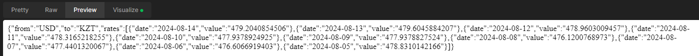
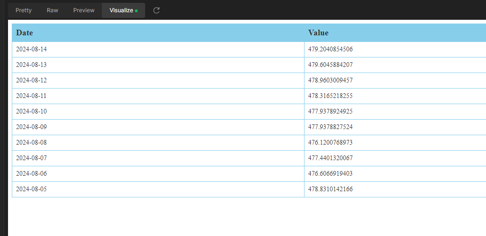
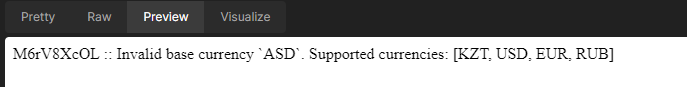

# Мини-документация проекта

### Описание проекта

Проект представляет собой серверное приложение, разработанное с использованием Spring Framework.
Оно предоставляет API для получения исторических курсов валют (USD, EUR, RUB) к тенге (KZT) за последние
10 дней из открытых источников.

* [currencyapi API](https://app.currencyapi.com)

#### *** Ограничения и замечания ***:

Из-за ограничений бесплатного доступа к API обмена валют, который позволяет получить данные
только за один день, для получения курса валют за последние 10 дней необходимо
выполнить 10 отдельных запросов.  
В идеальных условиях для получения данных за заданный период следует использовать API,
который поддерживает запросы по диапазону дат. Однако такая возможность требует платной подписки.  
Таким образом, в данном проекте я реализовал метод для получения данных с помощью 10 отдельных запросов,
что является менее эффективным, но я думаю в рамках тестового задания и с учетом бесплатного
доступа к API, является наилучшим доступным решением.

### Основные технологии:

* Java — основной язык программирования.
* Spring Boot — для создания и настройки веб-приложения.
* Maven — система сборки и управления зависимостями.
* OkHttp — библиотека для выполнения HTTP-запросов.
* Jackson — библиотека для обработки JSON.

### Структура проекта

* `aro.exchangeRate.inService` — содержит реализацию сервиса для взаимодействия с API обмена валют.
* `aro.exchangeRate.model.request` — модели запросов к API.
* `aro.exchangeRate.model.response` — модели ответов от API.
* `aro.exchangeRate.enums` — перечисления валют.
* `aro.exchangeRate.error` — пользовательские исключения для обработки ошибок.

### Использование API

Получение истории изменений курса валют к тенге

#### Пример запроса:

`GET http://localhost:8080/exchange-rate/api/v1/to-kzt/history?baseCurrency=USD`

#### Параметры запроса:

`baseCurrency` — валюта, относительно которой производится расчет (допустимые значения: `USD`, `EUR`, `RUB`).

#### Ответ:

Возвращает историю курсов валют за последние 10 дней к тенге (KZT) в формате JSON.

#### Обработка ошибок:

Если параметр `baseCurrency` указан неверно или отсутствует, сервер возвращает сообщение об ошибке и неполадке.

